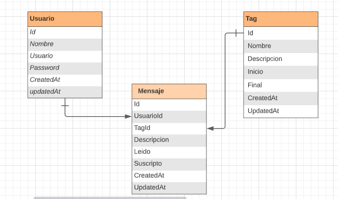
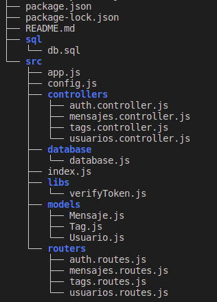

# Notificaciones App
Para poder hacerlo funcional deben clonar el repo y dentro de la carpeta hacer:

```
npm install 

cp .env
```

Configurar el .env con los datos de su base de datos junto con los datos para JWT y el puerto donde se correra la app


```
DB_HOST= 
DB_NAME= 
DB_USERNAME= 
DB_PASSWORD= 
DB_DIALECT= 
PORT = 

JWT_SECRETO = 
JWT_TIEMPO_EXPIRA = 
JWT_COOKIE_EXPIRE = 
```

y poner a andar el proyecto

```
npm start
```

## Modelo de base de datos




```
La base de datos de ejemplo esta en src/database (db.sql)
```

## Estructura del Proyecto


